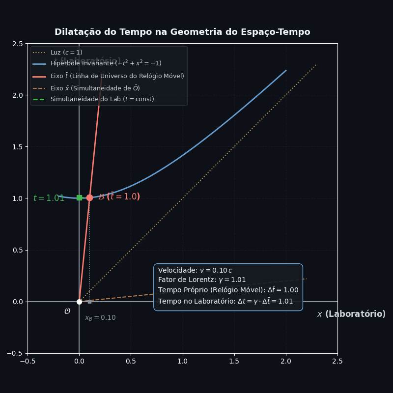
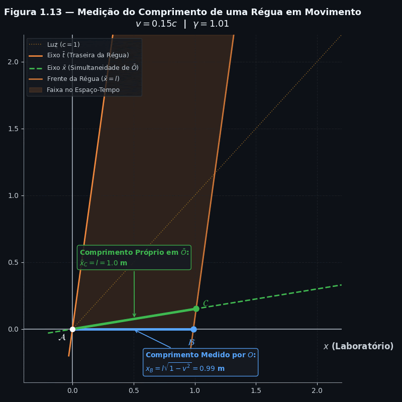

# Dilatação do Tempo e Contração do Comprimento 

**Uma explicação baseada na Seção 1.8 de Bernard Schutz** 📃 

Luana M. Souza

---

## 1. Contexto e Fundamentos Geométricos

A Seção 1.8 demonstra a Dilatação do Tempo e a Contração do Comprimento utilizando exclusivamente a geometria dos diagramas de espaço-tempo.

Toda a física decorre de dois pilares fundamentais estabelecidos até a Seção 1.7:

1. **A invariância do intervalo de espaço-tempo:**
   $$\Delta s^2 = -(\Delta t)^2 + (\Delta x)^2 = -(\Delta \bar{t})^2 + (\Delta \bar{x})^2$$
2. **A relatividade da simultaneidade:**
   O eixo espacial $\bar{x}$ do observador móvel $\bar{O}$ inclina-se para cima com inclinação $v$ no diagrama do observador em repouso $O$.

---

## 2. Dilatação do Tempo 

A dilatação do tempo responde à pergunta: *como o tempo medido por um único relógio em movimento se compara com o tempo medido pelos relógios do laboratório?*

### Construção no Diagrama de Espaço-Tempo 

:watch: Considere o observador do laboratório $O$ e o observador móvel $\bar{O}$ viajando com velocidade $v$ ao longo do eixo $x$.

:watch: O relógio de $\bar{O}$ viaja ao longo do seu próprio eixo do tempo $\bar{t}$ (onde $\bar{x} = 0$), cuja equação no gráfico de $O$ é $x = v \cdot t$.

:watch: Para calibrar a unidade de tempo de $\bar{O}$, desenhamos a hipérbole invariante do tipo-tempo que passa por $t = 1$ no eixo do laboratório:
$$-t^2 + x^2 = -1$$.

:watch: O relógio de $\bar{O}$ marca exatamente 1 segundo (ou 1 metro de tempo) no evento $B$, que é a interseção do eixo $\bar{t}$ com essa hipérbole.

  

### Dedução Algébrica Simples:

Substituindo a linha de universo de $\bar{O}$ ($x = v \cdot t$) na equação da hipérbole:

$$-t^2 + (v \cdot t)^2 = -1$$
$$-t^2 \cdot (1 - v^2) = -1$$
$$t^2 = \frac{1}{(1 - v^2)}$$
$$t = \frac{1}{\sqrt{1 - v^2}}$$

### Interpretação Física:

:hourglass: Para o observador móvel $\bar{O}$, decorreu um tempo próprio de apenas $\Delta \bar{t} = 1$ entre a origem e o evento $B$.

:hourglass: Para o observador do laboratório $O$, o evento $B$ ocorre no instante de tempo $t = \frac{1}{\sqrt{1 - v^2}} > 1$.

:hourglass: Como $t > \Delta \bar{t}$, o observador $O$ conclui que o relógio móvel está rodando mais devagar (**dilatação do tempo**).

---

## 3. Contração do Comprimento 

A contração do comprimento responde à pergunta: *como medimos a extensão de um objeto em movimento?*

### A Definição de Medição de Comprimento

Medir o comprimento de uma régua em movimento significa registrar as posições de suas duas extremidades **SIMULTANEAMENTE** (no mesmo instante de tempo do observador) e calcular a distância entre esses dois eventos.

  

### A Faixa no Espaço-Tempo 

Imagine uma régua de comprimento próprio $l$ que está em repouso no referencial móvel $\bar{O}$. A trajetória da régua no espaço-tempo forma uma "faixa" de linhas de universo paralelas (gif acima):

:straight_ruler: Extremidade traseira viaja ao longo do eixo $\bar{t}$ ($\bar{x} = 0$).

:straight_ruler: Extremidade dianteira viaja ao longo da linha $\bar{x} = l$.

### Comparativo entre os dois Observadores

**1. Comprimento medido por $\bar{O}$ (Comprimento Próprio):**

:straight_ruler: O observador móvel $\bar{O}$ mede as extremidades na sua linha de simultaneidade ($\bar{t} = 0$, o eixo $\bar{x}$).

:straight_ruler: A extremidade traseira está em $A(0,0)$ e a dianteira está no evento $C$, onde $\bar{t}_C = 0$ e $\bar{x}_C = l$. O comprimento próprio é $l$.

**2. Comprimento medido por $O$ (Laboratório):**

:triangular_ruler: O observador do laboratório $O$ precisa medir ambas as extremidades no seu próprio "Agora" ($t = 0$, o eixo $x$).

:triangular_ruler: A traseira está em $A(0,0)$ e a dianteira está no evento $B$, que é a interseção da linha da frente da régua com o eixo $x$ ($t = 0$).

### Dedução Geométrica:

O evento $C$ (localizado no eixo $\bar{x}$, cuja equação é $t = v \cdot x$) tem coordenadas no gráfico de $O$ dadas por:

$$x_C = \frac{l}{\sqrt{1 - v^2}} \quad \text{e} \quad t_C = \frac{v \cdot l}{\sqrt{1 - v^2}}$$

A linha de universo da frente da régua passa pelo evento $C$ e se desloca com velocidade $v$:

$$\Delta x = v \cdot \Delta t \implies x_C - x_B = v \cdot (t_C - t_B)$$

Como $t_B = 0$ para a medição simultânea em $O$:

$$x_B = x_C - v \cdot t_C$$
$$x_B = \left(\frac{l}{\sqrt{1 - v^2}}\right) - v \cdot \left(\frac{v \cdot l}{\sqrt{1 - v^2}}\right)$$
$$x_B = \frac{l \cdot (1 - v^2)}{\sqrt{1 - v^2}}$$
$$x_B = l \cdot \sqrt{1 - v^2}$$

### Conclusão Geométrica

:bulb: O comprimento medido pelo laboratório é $x_B = l \cdot \sqrt{1 - v^2}$, que é **menor** do que o comprimento próprio $l$.

:bulb: **Causa geométrica fundamental:** A falha de simultaneidade. Os dois observadores cortam a "faixa" da régua no espaço-tempo em ângulos de simultaneidade totalmente diferentes.

## Referências

- SCHUTZ, Bernard. *A First Course in General Relativity*. 3ª ed. Cambridge: Cambridge University Press, 2022. — Capítulo 1, Seções 1.4 e 1.5, e Exercício 1.3.

---

*Post baseado no experimento mental do relógio de luz e nos diagramas de Minkowski, seguindo a abordagem do livro de Bernard Schutz, "A First Course in General Relativity".*
